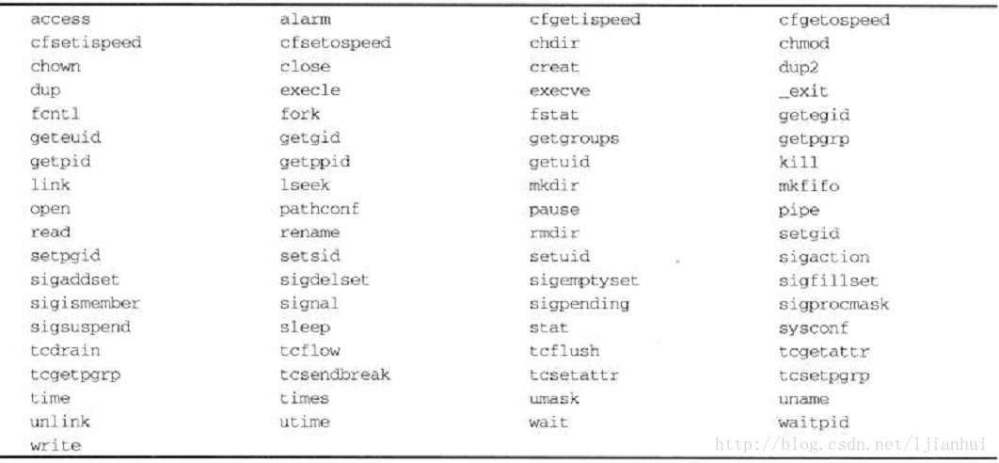

## 信号
### 1.信号处理-signal函数
- 头文件：#include <signal.h>
- 函数原型：void (*signal(int sig, void (*func)(int)))(int);
### 2.信号处理-sigaction函数
- 头文件：#include <signal.h>
- 函数原型：int sigaction(int sig, const struct sigaction *act, struct sigaction *oact)
### 3.发送信号
- kill函数
```
    #include <sys/types.h>
    #include <signal.h>
    int kill(pid_t pid, int sig);
```
- alarm函数
```
    #include <unistd.h>
    unsigned int alarm(unsigned int seconds);
```
### 4.信号处理函数的安全问题
当一个信号处理函数正在执行时，若有另外一个信号到达，则会打断当前的信号处理函数，称为是可重入函数。

### 5.参考
- [信号处理](https://www.cnblogs.com/52php/p/5813867.html)